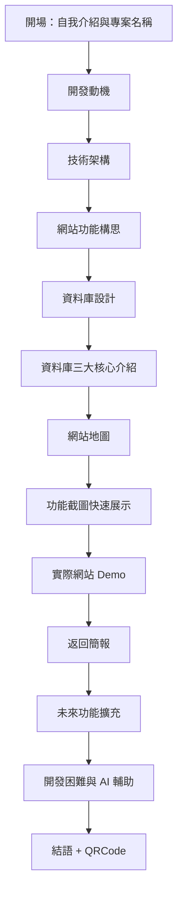

# Choose 專案報告文字稿

## 報告流程圖



---

## 一、開場：自我介紹與專案名稱

各位評審好，我是王凱，今天要報告的專案是 **Choose** — 一個電商服飾網站的全端開發專案。

Choose 的命名來自「選擇有品味的生活」這個理念，希望提供消費者一個簡潔、優雅的購物體驗。

---

## 二、開發動機

這個專案的開發動機有三個：

1. **驗證全端開發能力**：從資料庫設計、後端 API、到前端介面，完整走過一個電商網站的開發流程
2. **學習企業級框架實務**：深入理解 Spring Boot 的分層架構、JPA 資料庫操作、以及 RESTful API 設計
3. **解決真實業務問題**：如庫存管理、訂單追蹤、客服系統等，模擬真實電商運營情境

---

## 三、技術架構

| 層級         | 技術選型                              |
| ------------ | ------------------------------------- |
| **前端**     | Vue 3 + Vite + Tailwind CSS           |
| **後端**     | Spring Boot 3 + Spring Security + JPA |
| **資料庫**   | MySQL 8                               |
| **雲端服務** | Cloudinary（圖片儲存）                |
| **部署**     | Zeabur（PaaS 雲端部署）               |

### 後端架構分層

```
Controller 層 → 接收 HTTP 請求、回傳 API Response
      ↓
Service 層 → 業務邏輯處理、資料驗證
      ↓
Repository 層 → JPA 資料庫操作
      ↓
Model 層 → 資料庫實體映射
```

這樣的分層設計讓程式碼職責清晰、易於維護和測試。

### 第三方圖庫整合（Cloudinary）

透過 Cloudinary Java SDK 實現後端代理上傳：

1. 前端將圖片 File 傳至後端 `/api/upload` 端點
2. 後端 `ImageUploadService` 使用環境變數中的 `CLOUDINARY_URL` 進行認證
3. 上傳成功後取得 `secure_url`，儲存至資料庫 `image_url` 或 `color_images` 欄位
4. 前端從 API 取得圖片 URL 進行顯示

這樣設計確保 API Key 不暴露於前端，提升安全性。

### PaaS 雲端部署（Zeabur）

使用 Zeabur 進行前後端分離部署：

1. **後端服務**：透過 GitHub 連結自動偵測 Spring Boot 專案，自動建置 JAR 並部署
2. **前端服務**：偵測 Vite 專案，自動執行 `npm run build` 並部署靜態資源
3. **MySQL 服務**：Zeabur 提供 Managed MySQL，透過內網連線確保安全
4. **環境變數**：在 Zeabur 後台設定 `DATABASE_URL`、`CLOUDINARY_URL`、`JWT_SECRET` 等敏感資訊

---

## 四、網站功能構思

本專案功能圍繞電商核心流程設計：

### 1. 會員註冊/登入

- 支援「無密碼註冊」：用戶輸入 Email 後收到驗證信，點擊連結完成註冊
- 首次登入時設定密碼，後續可使用密碼或 Magic Link 登入
- JWT Token 維持登入狀態，存放於 localStorage

### 2. 瀏覽商品

- 響應式商品列表，支援分類篩選（Top/Bottom/Coat/Accessories/Shoes）
- 關鍵字搜尋功能，即時過濾商品名稱
- 首頁「新品上架」區塊展示精選商品

### 3. 選擇商品規格

- 商品詳情頁展示多張圖片（主圖 + 各顏色圖片）
- 動態按鈕選擇顏色與尺寸，系統自動標示「無庫存」規格
- 選擇後即時顯示對應顏色的商品圖片

### 4. 加入購物車暫存

- 登入用戶的購物車儲存於資料庫 `cart_items` 表
- 購物車支援數量調整、刪除項目
- 結帳前自動檢查庫存是否足夠

### 5. 訂單結帳

- 選擇配送方式（宅配/超商取貨）
- 填寫收件人資訊與地址
- 提交訂單後顯示訂單編號，可於會員中心查看

### 6. 用戶疑問服務支援

- 「聯絡我們」表單讓用戶提交問題
- 後台客服管理介面，支援回覆與結案
- 回覆時自動發送 Email 通知用戶

---

## 五、資料庫設計

根據功能需求，我設計了 **11 張資料表**：

| 類別       | 資料表                                       |
| ---------- | -------------------------------------------- |
| 使用者相關 | `users`、`verification_tokens`               |
| 商品相關   | `categories`、`products`、`product_variants` |
| 訂單相關   | `cart_items`、`orders`、`order_items`        |
| 客服相關   | `contact_messages`、`reply_templates`        |

---

## 六、資料庫三大核心介紹

資料庫設計以 **消費者**、**商品**、**訂單** 為三大核心，透過外部鍵（Foreign Key）串聯各表：

### 1️⃣ 消費者核心

```
┌─────────────────┐      FK: user_id      ┌─────────────────────┐
│     users       │◄─────────────────────│  verification_tokens │
│  (user_id PK)   │                       │     (user_id FK)     │
└─────────────────┘                       └─────────────────────┘
        │
        │ FK: user_id
        ▼
┌─────────────────┐
│     orders      │
│  (user_id FK)   │
└─────────────────┘
```

**關聯說明**：

- `verification_tokens.user_id` → `users.user_id`：驗證 Token 綁定用戶
- `orders.user_id` → `users.user_id`：訂單歸屬用戶

### 2️⃣ 商品核心

```
┌─────────────────┐      FK: category_id   ┌─────────────────┐
│   categories    │◄──────────────────────│    products      │
│ (category_id PK)│                        │ (category_id FK) │
└─────────────────┘                        └─────────────────┘
                                                    │
                                                    │ FK: product_id
                                                    ▼
                                           ┌─────────────────────┐
                                           │  product_variants   │
                                           │   (product_id FK)   │
                                           │   (sku_code UNIQUE) │
                                           └─────────────────────┘
```

**關聯說明**：

- `products.category_id` → `categories.category_id`：商品歸屬分類
- `product_variants.product_id` → `products.product_id`：規格歸屬商品

**SKU 編碼生成邏輯**（`ProductService.java`）：

- 格式：`P{商品ID}-{顏色縮寫}-{尺寸}-{6位隨機碼}`
- 範例：`P1-MORA-M-000001`（莫蘭迪綠 M 號）
- 由 `generateUniqueSku()` 自動生成，確保唯一性

### 3️⃣ 訂單核心（串聯消費者與商品）

```
┌─────────────────┐                        ┌─────────────────────┐
│     users       │                        │  product_variants   │
│  (user_id PK)   │                        │   (variant_id PK)   │
└─────────────────┘                        └─────────────────────┘
        │                                           │
        │ FK: user_id                               │ FK: variant_id
        ▼                                           ▼
┌─────────────────┐      FK: order_id      ┌─────────────────────┐
│     orders      │◄──────────────────────│    order_items       │
│  (order_id PK)  │                        │   (order_id FK)      │
│  (user_id FK)   │                        │   (variant_id FK)    │
└─────────────────┘                        └─────────────────────┘
```

**關聯說明**：

- `orders.user_id` → `users.user_id`：訂單歸屬用戶
- `order_items.order_id` → `orders.order_id`：訂單項目歸屬訂單
- `order_items.variant_id` → `product_variants.variant_id`：記錄購買的具體規格

**設計考量**：

- `order_items` 記錄當時價格，避免商品價格變動影響歷史訂單
- 購物車 `cart_items` 同樣透過 `variant_id` 關聯規格表

---

## 七、網站地圖

### 前台路由

```
/                   → 首頁（Hero + 新品 + Footer）
/collection         → 商品列表（分類篩選）
/product/:id        → 商品詳情頁
/cart               → 購物車
/checkout           → 結帳頁面
/account            → 會員中心
/contact            → 聯絡我們
```

### 後台路由

```
/admin              → 管理面板入口
  ├─ INVENTORY      → 商品庫存管理
  ├─ CATEGORIES     → 商品分類管理
  ├─ ORDERS         → 訂單管理
  ├─ MEMBERS        → 會員管理
  ├─ STATS          → 銷售統計
  └─ INQUIRIES      → 客服訊息管理
```

---

## 八、功能截圖快速展示

> [此處可放簡報截圖幻燈片]

- 首頁設計：大圖輪播 + 新品區
- 商品列表：卡片式排版 + 分類篩選
- 商品詳情：多圖切換 + 規格選擇
- 購物車：數量調整 + 總價計算
- 結帳流程：配送選擇 + 付款資訊
- 會員中心：訂單追蹤 + 個人設定
- 管理面板：庫存管理 + 訂單處理 + 客服回覆

---

## 九、實際網站 Demo

### Demo 流程（消費者端）

1. **首頁瀏覽**：展示 Hero 大圖和新品上架區
2. **點擊首頁大圖**：進入對應商品頁
3. **商品列表**：使用分類篩選（Top / Bottom / Coat）
4. **商品詳情**：選擇顏色、尺寸，加入購物車
5. **搜尋功能**：搜尋「外套」，展示搜尋結果
6. **加入購物車**：選擇另一件商品
7. **結帳流程**：點擊結帳，系統提示需登入
8. **信箱註冊**：輸入 Email，收到驗證信
9. **信箱驗證**：點擊驗證連結，自動跳回結帳頁
10. **配送選擇**：介紹宅配 / 店到店選項
11. **完成訂單**：提交訂單，查看訂單編號
12. **訂單備註**：填寫付款備註（轉帳後五碼）
13. **會員中心**：查看訂單狀態
14. **設定密碼**：首次登入設定密碼

### Demo 流程（管理員端）

1. **切換管理員帳號**：登入 admin@choose.com
2. **商品庫存管理**：
   - 展示商品列表
   - 點擊「庫存管理」調整各規格庫存
   - **說明 SKU 碼**：可用於快速搜尋商品規格
3. **新增商品**：
   - 填寫商品名稱、價格、描述
   - 上傳主圖和顏色圖片
   - 新增商品規格（顏色 + 尺寸 → 自動生成 SKU）
4. **商品分類**：展示分類管理介面
5. **訂單管理**：
   - 找到剛剛新增的訂單
   - 說明依處理進度篩選、訂單編號搜尋功能
   - 更新訂單狀態
6. **會員統計**：點擊會員查看消費統計 Modal
7. **銷售數據**：展示總銷售額、熱銷商品、月銷量分析
8. **客服訊息**：
   - 說明案件編號生成（CS-XXXX）
   - 展示回覆功能
   - **說明 Email 通知**：回覆後自動發送 Email 給用戶
   - 結案 / 重開功能

---

## 十、未來功能擴充

### 1. WebSocket 即時通知系統

**目標**：實現訂單狀態變更、新客服訊息、庫存警示的即時推送

**技術規劃**：

- 前端使用 Vue 的 `useWebSocket` composable
- 後端使用 Spring WebSocket + STOMP 協定
- 區分頻道：`/topic/orders`（訂單）、`/topic/messages`（客服）、`/topic/inventory`（庫存）
- 管理面板接收即時通知，消費者接收訂單更新

**應用場景**：

- 管理員：新訂單進來時桌面通知
- 消費者：訂單出貨時即時推送

### 2. 串接第三方金流

**目標**：整合 ECPay 綠界金流，實現線上付款

**實作規劃**：

1. **建立付款請求**：

   - 結帳時呼叫後端 `/api/payment/create` 產生訂單
   - 後端組裝 ECPay 所需參數（MerchantID、TradeNo、TotalAmount、CheckMacValue）
   - 回傳帶有簽名的表單資料給前端

2. **前端跳轉付款**：

   - 前端使用隱藏表單 POST 至 ECPay 付款頁
   - 用戶完成付款後，ECPay 導回指定的 ReturnURL

3. **後端接收回調**：

   - ECPay 以 POST 呼叫 `NotifyURL`（Webhook）
   - 後端驗證 CheckMacValue 確保來源正確
   - 驗證通過後更新訂單狀態為 `PAID`

4. **資料庫擴充**：
   - `orders` 表新增 `payment_tx_id` 欄位記錄金流交易編號
   - 方便對帳與退款查詢

---

## 十一、開發困難與 AI 輔助

在開發過程中，主要遇到三個面向的挑戰：**企業級框架的學習曲線**、**第三方服務的整合**，以及**如何正確運用 AI 工具輔助學習**。以下分別說明：

### Spring Boot 難點

**挑戰**：首次接觸企業級 Java 框架，概念繁多

- **依賴注入**：理解 `@Autowired`、`@RequiredArgsConstructor` 的用途
- **JPA 關聯映射**：設定 `@OneToMany`、`@ManyToOne`、懶加載策略
- **Spring Security**：配置 JWT 認證、CORS 跨域、權限控管

**AI 輔助學習**：

- 請 AI 解釋「為什麼 Service 層要加 `@Transactional`」
- 透過 AI 比較「`FetchType.LAZY` vs `EAGER` 的效能差異」
- 讓 AI 生成範例後，逐行理解程式邏輯

### Cloudinary 第三方整合難點

**挑戰**：第一次串接雲端圖片服務

- 環境變數配置（`CLOUDINARY_URL`）
- 圖片上傳 API 的 Response 解析
- 前端與後端的上傳流程決策（簽名上傳 vs 後端代理）

**解決方式**：

- 使用 AI 協助閱讀官方文件、理解 SDK 用法
- 先在 Postman 測試 API，再整合到專案
- 最終選擇後端代理上傳，確保 API Key 安全

### AI 輔助開發心得

**正確使用方式**：

1. **學習導向**：請 AI 解釋原理，而非直接複製程式碼
2. **逐步驗證**：每個功能先理解再整合
3. **追問細節**：「這段程式碼為什麼這樣寫？如果改成這樣會怎樣？」

**收穫**：

- 加速學習曲線，快速理解 Spring Boot 生態系
- 遇到錯誤時，AI 協助分析 Stack Trace
- 學會辨別 AI 建議的正確性，培養獨立判斷能力

---

## 十二、結語

感謝各位評審的聆聽！

Choose 是我從零到一完成的全端專案，涵蓋：

- ✅ 前端：Vue 3 響應式設計
- ✅ 後端：Spring Boot 企業級架構
- ✅ 資料庫：MySQL 關聯設計
- ✅ 部署：雲端服務整合

歡迎掃描 QR Code 體驗網站或查看我的履歷！

| 網站 Demo | 履歷      |
| --------- | --------- |
| [QR Code] | [QR Code] |

謝謝！
